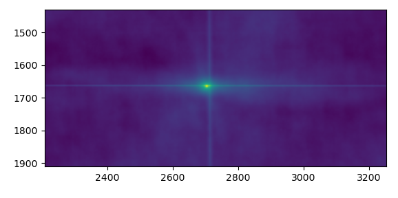

# Correzione della georeferenziazione in immagini Saocom utilizzando Sentinel-1 

Nelle immagini SAOCOM XML le informazioni dell’orbita sono contenute in  
	<pSV_m> → posizione del satellite (m) 
	<vSV_mOs> → velocità del satellite (m/s) 
Queste sono probabilmente effemeridi broadcast, infatti la tipologia di georeferenziazione è OLF (On-line Fast) – a differenza comunque di ONVF (Very). Le informazioni sulle orbite precise non sono nel sito.
Come work-around si possono coregistrare le immagini l’una con l’altra. Con SNAP la Dem Assisted Coregistration non funziona, invece il tool Coregistration lavora bene ma con immagini della stessa orbita. Invece, lo shift di georeferenziazione è soprattutto evidente tra immagini di orbita diversa. 

È stata quindi sviluppata una procedura in python: 
1. **Preparazione**: imagini Saocom in Equi7 tiles e creazione immagine media Sentinel-1 per l’Austria a partire da dati GRDH (sarebbe meglio con gamma).
Quest’ultima è generata preprocessando tutte e 13 le immagini Sentinel-1 (8 asc e 5 des):
	Orbit file – Thermal Noise – Removal – Border Noise Removal – Calibration – Terrain Correction - dB
Quindi ho creato un mosaico asc e un mosaico des per tutta Austria e diviso in tiles Equi7 grid.

  
3.  I **nodata** nell’immagine Saocom e Sentinel-1 diventano 0 e i valori sono normalizzati sottraendoli alla media.
Il problema è che quando ci sono tanti no data il valore di C finale cambia. Forse non conta la quantità di nodata ma il fatto che siano molto sparsi nell’immagine – quindi questo passaggio dovrebbe essere fatto prima del mascheramento? Anche prima della divisione in tiles perché in alcune immagini in montagna non ci sono punti di riferimento. Sarebbe meglio sfruttare l’intera immagine? Cerco di verificare quante immagini vengono correttamente shiftati e quali no.

4. Calcolo lo shift per ogni immagine tramite **cross-correlation 2D** 
$C(y,x)= \sum_{(i,j)}[A(i,j)∙B(i+y,j+x)]$ 
Dove y è lo shift verticale, x è lo shift orizzontale,  A  è il valore di backscatter dei pixel nell’immagine di riferimento (Sentinel-1) e B per l’immagine da shiftare (SAOCOM). 
Per ogni spostamento calcolo il prodotto in ciascun pixel e poi lo sommo (convoluzione): questo è C, che è massimo quando i pattern coincidono. Se invece i pattern sono diversi C è piccolo. Quindi ottengo tanti valori di C(y,x) per ciascun spostamento e devo selezionare il massimo. Questi valori sono organizzati in una matrice in cui al centro ho spostamento 0, shift orizzontale nelle colonne e shift verticale nelle righe.

Il punto più chiaro è quello in cui C è maggiore; non è esattamente al centro ma ha un certo shift, che è appunto quello che mi serve per traslare l’immagine.
Se le immagini hanno righe (H) e colonne (W) : 
$A: H_A x W_A$ 
$B: H_B x W_B$ 
La dimensione della matrice C è data da: 
$C (shape)=H_A+ H_B-1,W_A+ W_B-1 $ 
Calcolare la Cross-correlation 2D per immagini SAR ad alta risoluzione sarebbe molto lento, perché, ad esempio, avendo immagini in Tiles da 10000 x 10000 pixels la dimensione di C sarebbe: $C=10000∙2-1,10000∙2-1=19999,19999$ Quindi dovrei testare $19999 ∙19999=4 ∙10^8$ spostamenti, ciascuno dei quali richiederebbe 10000∙10000 moltiplicazioni e una somma. In totale $4 ∙10^8∙10^8= 4 ∙10^16$ moltiplicazioni. Questo non è possibile, quindi si ricorre alla trasformata di Fourier. 
$Convolve (A,B)=IFFT(FFT(A)∙(FFT(B))$ 
Dove FFT converte nello spazio delle frequenze entrambe le immagini. Nello spazio delle frequenze la convoluzione si riduce ad una moltiplicazione punto-punto. Infatti, convolvere due segnali nello spazio reale vuol dire moltiplicare i loro spettri in frequenza. IFFT riconverte il risultato nello spazio reale. 

6. Valuto la **bontà degli shift**. Gli shift orizzontali vanno da circa 6 a 11 (con asc solitamente negativo), mentre quelli verticali sono 0 o 1.  Shift estremamente grandi andrebbero esclusi 

7. **Applico lo shift** a ciascuna immagine a tutte le bande 

8. Salvo il **file di log** con nome del file, correlazione di Pearson prima e dopo, shift 

